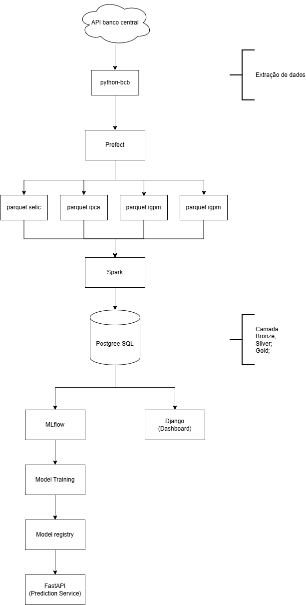

# Previsao_da_Selic
Plataforma end-to-end de Engenharia de Dados e Machine Learning para ingestão, processamento, análise e previsão de indicadores macroeconômicos brasileiros como SELIC, IPCA, IGPM e Dólar (USD/BRL).

O projeto implementa uma arquitetura moderna baseada em Data Lakehouse + MLOps, transformando dados econômicos brutos em previsões automatizadas e visualizações analíticas.

## 🚀 Visão Geral do Projeto

A Previsao_da_Selic realiza automaticamente:

- Coleta de dados econômicos via API do Banco Central
- Processamento em múltiplas camadas (Bronze, Silver e Gold)
- Validação de qualidade dos dados
- Engenharia de atributos
- Treinamento e versionamento de modelos preditivos
- Disponibilização de previsões via API
- Visualização em dashboard interativo

O objetivo é simular uma plataforma real de dados utilizada em instituições financeiras.

##🏗️ Arquitetura da Solução

